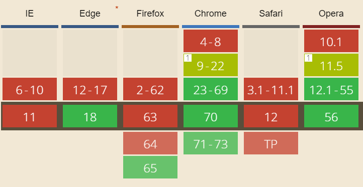

## WEBP Image Format
WebP is an open source image format developed at google, which promises to generate images smaller in size compared to jpg and png formats.
WebP images are 25-34% smaller than compare to JPEG,PNG images.

### Online converter 

   [convertJPGtoWebP](https://convertio.co/jpg-webp/)

### Using node js module can convert Jpeg,png to WebP format.

   1) install latest node js version. 
   
   2) Run this command ```$ npm install -g webp-converter-cli ```

   3) After installation, just run command ```webpc``` in ternimal.

### Fallback option for the browser, which doesn’t support WebP.

   1) ``````

   2) ``` <picture> <source srcset="images/logo.webp" type="image/webp">    </picture>```
   
   3) CSS fallback 
      Modernizr : Detection library that detects available features in browsers.
      For more info [CSS fallback WebP](https://css-tricks.com/using-webp-images/)

### WebP Browser Support
   
    
